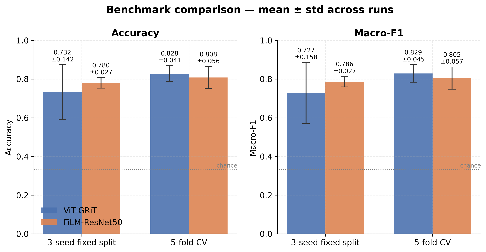
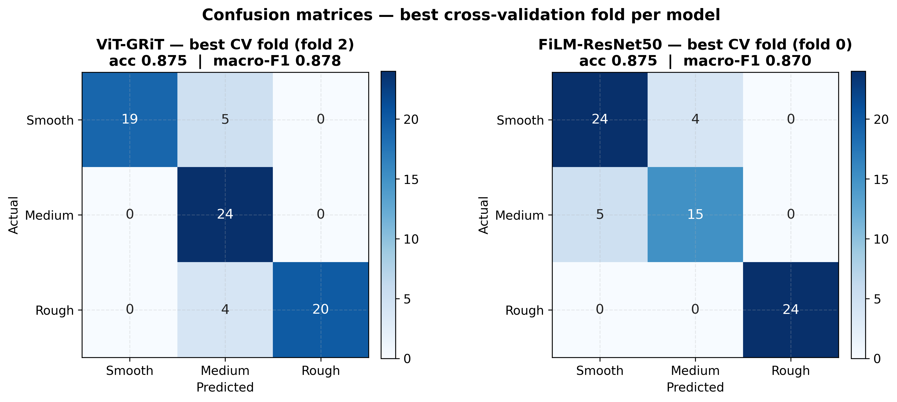
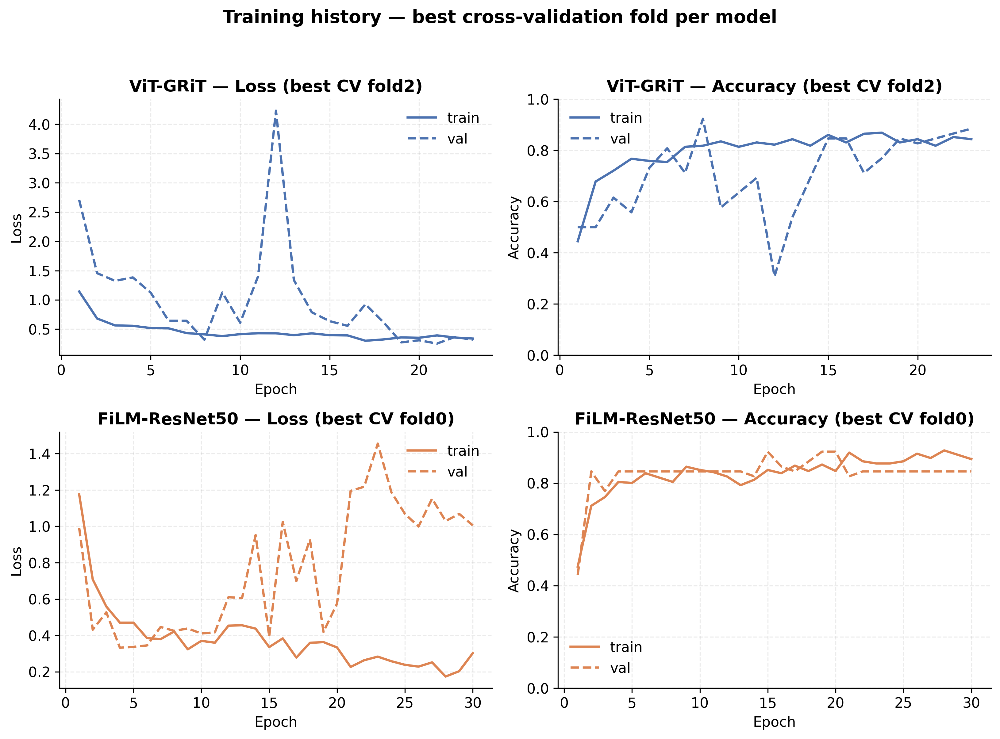
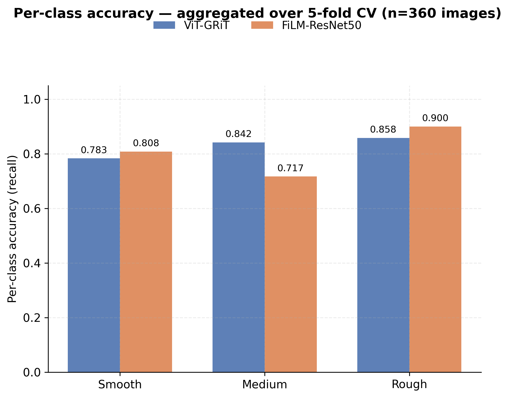
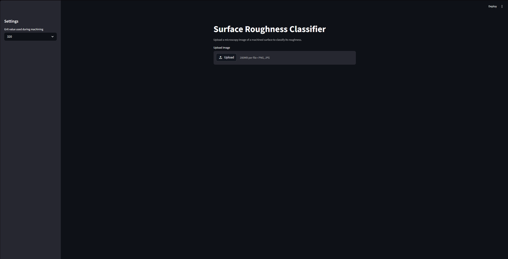
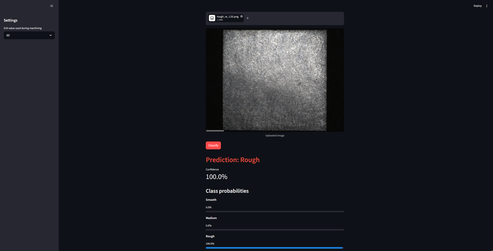
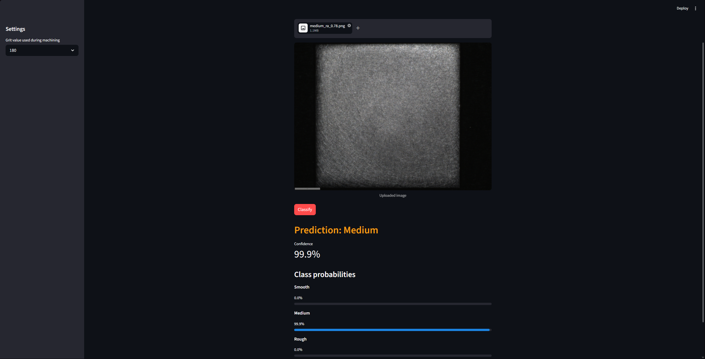
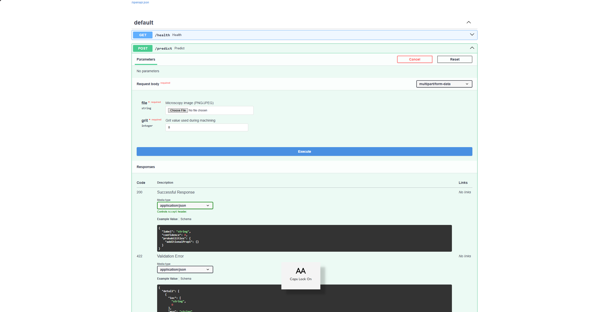

# 🔬 Surface Roughness Prediction

**Vision-based surface roughness classification for machined metal parts — from a microscopy image and the abrasive grit, predict whether a surface is Smooth, Medium, or Rough.**

### 🚀 **[Try the live demo →](https://surface-roughness-demo.streamlit.app)**

[](https://surface-roughness-demo.streamlit.app)


---

## Overview

Given a microscopy image of a machined surface **plus the grit value** of the abrasive used to finish it, this project classifies the surface roughness into one of three classes — **Smooth**, **Medium**, or **Rough** — derived from the measured roughness parameter *Ra* (mean arithmetic roughness, µm).

## 💡 Why it matters

Surface roughness directly governs a part's **friction, wear, fatigue life, sealing, and overall product quality** — it is one of the most common quality-control checks in manufacturing. Measuring it the traditional way, with a contact **profilometer**, is slow, requires specialized hardware, and inspects only a tiny track of the surface at a time. A **vision-based** approach turns any microscopy or camera image into an instant roughness estimate, making quality control **fast, contactless, and scalable** to full surfaces and high-throughput inspection lines.

## ✨ Key features

- 🧩 **Multimodal input** — fuses the image with the machining **grit value**, since the same visual texture maps to different roughness depending on the abrasive used.
- 🏛️ **Two complementary architectures** — a Vision Transformer (**ViT-GRiT**) and a **FiLM-ResNet50**, each conditioning on grit in a different way.
- 🔬 **Rigorous evaluation** — decoupled split/training seeds, **multi-seed** runs *and* **5-fold cross-validation** to separate model variance from data-split variance.
- 🚀 **Production-ready** — **FastAPI** inference service, **Streamlit** demo UI, **Docker Compose** orchestration, and **MLflow** experiment tracking.

---

## 📊 Results

Two evaluation protocols (both at a fixed data split seed of 42), reported as **mean ± std**:

| Protocol | Metric | ViT-GRiT | FiLM-ResNet50 |
|----------|--------|:--------:|:-------------:|
| 3-seed fixed split | Accuracy | 0.732 ± 0.142 | **0.780 ± 0.027** |
| 3-seed fixed split | Macro-F1 | 0.727 ± 0.158 | **0.786 ± 0.027** |
| 5-fold CV | Accuracy | **0.828 ± 0.041** | 0.808 ± 0.056 |
| 5-fold CV | Macro-F1 | **0.829 ± 0.045** | 0.805 ± 0.057 |

**Key takeaway:** ViT-GRiT has the **higher peak accuracy** (5-fold CV) but is **unstable** to the training seed — one seed collapsed it to 0.571. FiLM-ResNet50 is **~5× more stable** and essentially reproducible, at a mean within noise of ViT-GRiT. For production, **FiLM-ResNet50 is the safer default**; for peak accuracy, ViT-GRiT with seed control. The two models also have **complementary per-class strengths**, hinting that an ensemble could outperform either alone.

> Full analysis with methodology and live-computed tables: [`notebooks/02_training.ipynb`](notebooks/02_training.ipynb).

### Benchmark comparison


### Confusion matrices (best CV fold per model)


### Training history


### Per-class accuracy (aggregated over 5-fold CV)


---

## 🛠️ Tech stack

| Area | Tools |
|------|-------|
| Deep learning | PyTorch 2.5, torchvision, [timm](https://github.com/huggingface/pytorch-image-models) (ViT) |
| Data / evaluation | scikit-learn (group-stratified split + CV), NumPy, pandas, Pillow |
| Experiment tracking | MLflow |
| Serving | FastAPI, Uvicorn |
| Demo UI | Streamlit |
| Packaging | Docker, Docker Compose |
| Visualization | Matplotlib |

---

## 🚀 Quick start — local

```bash
# 1. Clone
git clone https://github.com/NassabOussama/surface-roughness-ml.git
cd surface-roughness-ml

# 2. Create and activate a virtual environment
python -m venv venv
source venv/bin/activate          # Windows: venv\Scripts\activate

# 3. Install dependencies
pip install -r requirements.txt
```

### Train

> The real dataset is **not** included (see [Dataset](#-dataset)). Point `--images_path` / `--labels_path` at your own copy.

```bash
# Train the Vision Transformer model
python train.py \
    --images_path old/Images \
    --labels_path old/Labelisation_CSV.csv \
    --model vit_grit \
    --output_dir outputs/vit_run

# Train the FiLM-ResNet50 model
python train.py --images_path old/Images --labels_path old/Labelisation_CSV.csv --model film_resnet50

# 5-fold cross-validation
python train.py --images_path old/Images --labels_path old/Labelisation_CSV.csv --model vit_grit --kfold 5

# Multiple training seeds on the SAME fixed test split (for fair model comparison)
python train.py --images_path old/Images --labels_path old/Labelisation_CSV.csv --split_seed 42 --seed 123
```

Useful flags: `--epochs`, `--batch_size`, `--lr`, `--seed`, `--split_seed`, `--kfold`. Runs are logged to MLflow (`mlflow ui --backend-store-uri sqlite:///mlflow.db`).

### Serve locally

```bash
# Inference API (point CHECKPOINT_PATH at a trained .pth)
CHECKPOINT_PATH=outputs/vit_run/<checkpoint>.pth uvicorn api.main:app --host 0.0.0.0 --port 8000

# Demo UI (in another terminal, with the API running)
API_URL=http://localhost:8000 streamlit run ui/app.py
```

## 🐳 Quick start — Docker

```bash
# Builds and starts both the API and the UI
docker-compose up --build
```

| Service | URL |
|---------|-----|
| FastAPI (docs at `/docs`) | http://localhost:8000 |
| Streamlit UI | http://localhost:8501 |

> Mount a trained checkpoint to `/app/model.pth` (see the commented volume in [`docker-compose.yml`](docker-compose.yml)).

---

## 📁 Project structure

```
surface-roughness-ml/
├── api/                    # FastAPI inference service
│   ├── main.py             #   /predict + /health endpoints
│   ├── predictor.py        #   checkpoint loading + inference wrapper
│   └── Dockerfile
├── ui/                     # Streamlit demo front-ends
│   ├── app.py              #   local/Docker — calls the FastAPI service
│   ├── app_standalone.py   #   Streamlit Cloud — loads the model in-process
│   └── Dockerfile
├── data/
│   ├── dataset.py          # group-stratified split + k-fold + Dataset
│   ├── transforms.py       # train/eval image transforms
│   └── sample_images/      # 6 demo images (2 per class) — see its README
├── models/
│   ├── vit_grit.py         # ViT backbone + grit-embedding concat
│   └── film_resnet50.py    # ResNet50 + FiLM grit conditioning
├── notebooks/
│   ├── 01_EDA.ipynb        # dataset exploration
│   └── 02_training.ipynb   # training story + model comparison
├── assets/                 # benchmark figures (used in this README)
├── config.py               # Config dataclass, classes, Ra thresholds
├── train.py                # training entry point (MLflow, AMP, early stopping)
├── evaluate.py             # metrics + plotting
├── make_assets.py          # regenerates the benchmark figures
├── docker-compose.yml
├── requirements.txt            # full project deps (training + serving + UI)
└── requirements-streamlit.txt  # lean CPU-only deps for the standalone Cloud demo
```

---

## 🧠 Model architectures

Both models take an **image + grit index** and output 3-class logits. The grit value is mapped to a learned embedding, and the two architectures fuse it differently:

- **ViT-GRiT** — a `vit_base_patch16_224` backbone (ImageNet-pretrained) whose 768-d CLS feature is **concatenated** with a 64-d grit embedding, then passed through an MLP classification head.
- **FiLM-ResNet50** — a ResNet-50 backbone whose feature maps (after `layer2`/`layer3`/`layer4`) are modulated by the grit embedding via **FiLM** (Feature-wise Linear Modulation): `output = γ(grit) · features + β(grit)`.

---

## 📦 Dataset

> ⚠️ **The real dataset is private and not included in this repository.**

- **90 physical samples × 4 viewing angles = 360 microscopy images**, spread evenly over **10 grit grades** (60–600).
- Labels come from cutting `Ra_Moyenne` at its **33rd / 67th percentiles** (0.653 / 0.960 µm), giving **balanced classes** (30 / 30 / 30 samples).
- The split is **group-stratified**: all four angles of a sample stay in the same fold (no leakage), stratified by grit.

To try the model without the full dataset, use the bundled demo images in [`data/sample_images/`](data/sample_images/) — two representative examples per class, with their original IDs, true Ra, and grit documented.

---

## 📓 Notebooks

| Notebook | What it covers |
|----------|----------------|
| [`notebooks/01_EDA.ipynb`](notebooks/01_EDA.ipynb) | Dataset exploration — grit & Ra distributions, the Ra→class mapping, sample images, per-class image statistics. |
| [`notebooks/02_training.ipynb`](notebooks/02_training.ipynb) | The full training story — methodology, results, the model trade-off, and the recommendation (all numbers computed live from checkpoints). |

> The notebooks additionally require `pandas` and `jupyter` (`pip install pandas jupyter`).

---

## 🌐 Live demo

### 🚀 [surface-roughness-demo.streamlit.app](https://surface-roughness-demo.streamlit.app)

A hosted Streamlit app where you can classify a machined surface in seconds: pick the abrasive grit value, give it a microscopy image, and get the predicted roughness class with a confidence breakdown across Smooth / Medium / Rough.

- 🖱️ **No upload required** — the demo includes six bundled [sample images](data/sample_images/) (two per class); click any one to load it (the correct grit is filled in automatically) and classify instantly. You can also upload your own image.
- 🧠 **Model:** the **FiLM-ResNet50** checkpoint (best cross-validation fold, **87.5%** accuracy), loaded directly in-process — no backend required.
- ⚙️ Runs the standalone front-end [`ui/app_standalone.py`](ui/app_standalone.py) on Streamlit Community Cloud (CPU).

The repository ships **two Streamlit front-ends** with the same UX but different backends:

| File | Backend | When to use it |
|------|---------|----------------|
| [`ui/app.py`](ui/app.py) | Calls the FastAPI service over HTTP | **Local or Docker** deployment (pairs with the [Quick start — Docker](#-quick-start--docker) stack) |
| [`ui/app_standalone.py`](ui/app_standalone.py) | Loads the model directly in-process | **Streamlit Community Cloud** — uses the lean [`requirements-streamlit.txt`](requirements-streamlit.txt) (CPU-only torch). Checkpoint location (local path or http(s) URL) is configurable via Streamlit secrets (`checkpoint_path`) or the `CHECKPOINT_PATH` env variable. Includes a sample-image picker so visitors can test without uploading. |

## 📸 Screenshots

**Streamlit demo — main interface.** Upload a microscopy image and pick the grit value used to machine the surface.



**Rough surface loaded (grit 60).** The uploaded image is previewed before classification.



**Medium surface loaded (grit 180).** Another sample ready to classify in the app.



**FastAPI interactive docs (Swagger UI).** The `POST /predict` endpoint takes an image plus a grit value and returns the predicted class, confidence, and per-class probabilities; `GET /health` reports model status.



---

## 🔭 Future work

- 🤝 **Ensemble both models** — ViT-GRiT and FiLM-ResNet50 have complementary per-class strengths (ViT stronger on *Medium*, FiLM stronger on *Rough*); a simple averaging ensemble should combine peak accuracy with stability.
- 🎯 **Improve the Smooth/Medium boundary** — nearly all errors concentrate there; class-balanced loss, threshold revisiting, or targeted augmentation could help.
- 📈 **Larger / more diverse dataset** — more samples, materials, and imaging conditions to improve generalization and tighten confidence intervals.
- 🔁 **Nested cross-validation** — folds × seeds to separate both variance sources at once for a publication-grade comparison.

---

## 👤 Author

**Oussama Nassab** — Master's student in Engineering, Université du Québec à Rimouski (UQAR)

- GitHub: [@NassabOussama](https://github.com/NassabOussama)
- Email: oussamanass@gmail.com

---

## 📄 License

Released under the **MIT License**.
